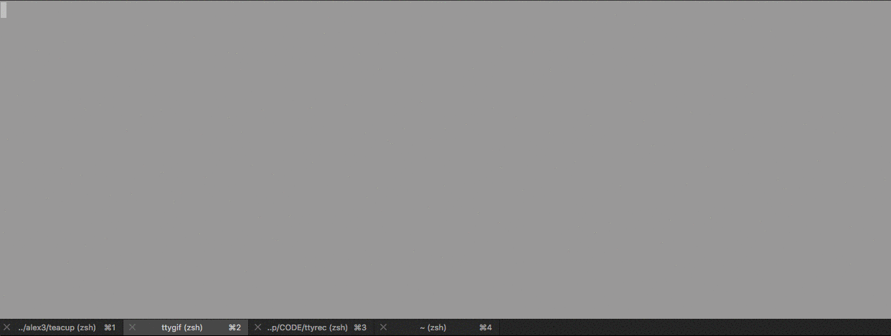

# Hookay So...

## BananaBus ole' trick o' the road!

 🍌 🚌  
 
 BananaBus is a humble and simple bash script that automates the initial workflow of setting up a basic html site.

 Think of it as an entire folder level boiler plate for setting up HTML, CSS, and JS directories, and their contents. 

It then "inits your git" on that folder, and even launches your code editor of choice with your HTML boiler plate already typed up and files already structured.

----

### "This sounds amazing! Whats the catch?" ~You 

You're gonna have to work for it a little bit... 😈

## Note about this project

This project was not only created as a quick install for your common ailments, it was also meant to show anyone out there new to, or curious about **bash scripting** just how *easy* it is to: 
* write lists of commonly used, helpful commands just once.
* store them right at your fingertips in the form of one easy to type command. 
* have your computer execute them as many times as your little heart desires.
* quit fearing the command line and gain some real technical wizardry.

Hopefully you learn something, I know I did 🧀 

----
## Prerequisites

* If you want to view an image in your terminal (like I have below) I suggest having [ITerm2](https://www.iterm2.com/) and subsiquentially [imgcat](https://github.com/eddieantonio/imgcat) installed.

* You should have a Unix based system, Mac or Linux.

* If you want the editor of your choice to launch you should already have the alias for it installed.

* This should also probably not be your first day using the command line ideally, though if it is...welcome to a whole new world of power.

## Usage
1. Clone this repo.
2. make sure bananabus is given executable permission.

        chmod +x bananabus

3. Open bananabus in your favorite editor and edit the following:
 * Change the image path on line 5 to the image you would like to display when the command is executed:
         
        1 #!/bin/bash
        2
        3 #MAKE SURE YOU HAVE IMGCAT INSTALLED
        4 #ADD AN IMAGE IF YOU WOULD LIKE TO PRINT ONE OUT TO YOUR CONSOLE    
        5 imgcat ~/path/to/image.jpg <--Edit this to a picture you want displayed

  * **Create Your own index.html boiler plate file** wherever you want to store it. 
  
  (I leave the above step up to to as everyone has their own preferences on html templates/boilerplates. Ideally you should put it somewhere easy to access in case you want to edit it later.)
  * Back in your editor change the following on line 11:
            
        10 #CREATE YOUR OWN HTML BOILER PLATE AND INSERT BELOW USING IT'S OWN RELATIVE PATH
        11 cat ~/path/to/index.html >> index.html <-- leave the 'cat' alone reeeeer  🐱

 * If you want the image you used inside your document waiting for you when you open up your page, add the file path here at line 13:

        12 #USE THE IMAGE PATH FROM EARLIER IF YOU WOULD LIKE TO INSERT IT INTO YOUR DOCUMENT
        13 cp ~/path/to/image.jpg . <-- leave the period alone (it's supposed to be there).

 * Lastly just change the text editor you would like to use so it launches using your text editor of choice!

        16 #EDIT BELOW FOR A TEXT EDITOR OF YOUR CHOICE
        17 text-editor-of-choice . <-- once again leave the period alone!

4. move **bananabus** to the /bin/ folder of choice.
    
        mv ./bananabus/path/to/bin

 ## wait...what is this bin you speak of?

----

[Here is a really great explanation](http://www.linfo.org/bin.html)

Here is my shit attempt at an explanation:

>It is essentially where you put scripts like these so they can be executed with just one command usually refered to as an alias. (*see the example below* for what i mean by one command )

----

  # Here she is in all of her glory!

  ## Troubleshooting

**If the command is not executing make sure:**

1.That you changed the mode to executable (See step 2. and this time real ALL of the instructions ya' dangus)

2.Make sure that the bin folder that contains it is inside your $PATH

    cat $PATH

You should see a long list of file paths separated by colons ( : )

 (be mature please...)

If you don't see the file path in which your script is stored inside of that list [ here ](https://google.com) is a really good link to just about everything you would ever need to learn about using computers. 

Learn to use it, and use it wisely 😉

### More on Bash Scripting
* [Dev Hints - Bash Scripting Cheat Sheet](https://devhints.io/bash)
* [Codecademy - Learn the Command Line / Bash Scripting](https://www.codecademy.com/learn/learn-the-command-line/modules/bash-scripting)
* [Ryans Tutorials - What is a Bash Script?](https://ryanstutorials.net/bash-scripting-tutorial/bash-script.php)
* [This Video - Joe Collins is the man!!](https://www.youtube.com/watch?v=oxuRxtrO2Ag)
